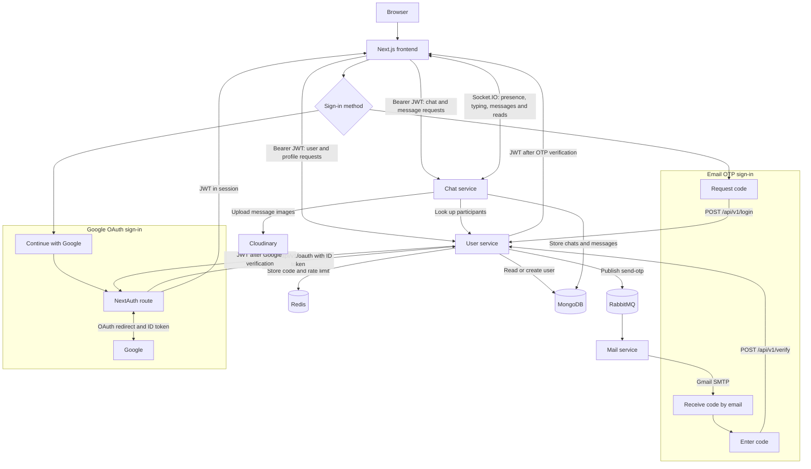

# WebChat

WebChat is a one-to-one messaging app with email one-time codes and Google sign-in, text and image messages, and live presence, typing, and read updates. The frontend is a Next.js app; the backend consists of separate user, chat, and mail services.

## Architecture



For email sign-in, the browser requests a code from the user service, receives it through the mail worker, and submits it for verification. For Google sign-in, NextAuth obtains a Google ID token and sends it to the user service. Both paths end with an application JWT; the frontend sends that token on protected REST requests. Chat updates then arrive over the separate Socket.IO connection.

- **Frontend (`frontend/`):** Next.js 16 and React 19. Browser requests go directly to the user and chat REST APIs. The browser also connects to the chat service through Socket.IO. NextAuth handles Google sign-in and exchanges Google's ID token with the user service for an application JWT.
- **User service (`backend/user/`, port 5000):** Handles email codes, Google token verification, user profiles, and JWT issuance. It stores users in MongoDB, temporary codes and rate limits in Redis, and queues code emails in RabbitMQ.
- **Chat service (`backend/chat/`, port 5002):** Stores conversations and messages in MongoDB, uploads images to Cloudinary, looks up user details through the user service, and emits live Socket.IO events.
- **Mail service (`backend/mail/`, port 5001 inside Compose):** Consumes the `send-otp` RabbitMQ queue and sends messages through Gmail SMTP. It has no browser-facing API.

The two backend services use the **same `JWT_SECRET`** to issue and verify application tokens. Both MongoDB connections currently select the `chat-app` database in code, regardless of the database name in `MONGO_URI`.

## Prerequisites

- Node.js 24 and npm for the frontend and for running backend services outside Docker (the backend Dockerfiles use Node.js 24).
- Docker with Compose for the provided backend stack.
- MongoDB and Redis instances reachable **from the backend containers**. The provided Compose file does not start either one.
- A Cloudinary account for image uploads, Google OAuth credentials for Google sign-in, and Gmail SMTP credentials (such as an app password) for email codes.

## Local setup

The backend Compose configuration builds the three services and starts RabbitMQ. Run these commands from the repository root:

```bash
cp backend/.env.example backend/.env
cp backend/user/.env.example backend/user/.env
cp backend/chat/.env.example backend/chat/.env
cp backend/mail/.env.example backend/mail/.env
cp frontend/.env.example frontend/.env.local
```

Edit the copied files before starting anything:

| File | Required configuration |
| --- | --- |
| `backend/.env` | Set `RABBITMQ_USER` and `RABBITMQ_PASS`. Compose supplies these to RabbitMQ and passes matching credentials to the user and mail containers. |
| `backend/user/.env` | Set `MONGO_URI`, `REDIS_URL`, `JWT_SECRET`, `GOOGLE_CLIENT_ID`, and `FRONTEND_URL=http://localhost:3000`. Keep `PORT=5000`. |
| `backend/chat/.env` | Set `MONGO_URI`, the same `JWT_SECRET`, Cloudinary credentials, and `FRONTEND_URL=http://localhost:3000`. Keep `PORT=5002`. Compose overrides `USER_SERVICE` with `http://user-service:5000`. |
| `backend/mail/.env` | Set `MAIL_USER` and `PASSWORD` for Gmail SMTP. Keep `PORT=5001`. |
| `frontend/.env.local` | Set `GOOGLE_CLIENT_ID` and `GOOGLE_CLIENT_SECRET`; keep the example's localhost API and Socket.IO URLs. Set `NEXTAUTH_URL=http://localhost:3000` and a generated `NEXTAUTH_SECRET` for NextAuth. |

Use MongoDB and Redis hostnames or IP addresses that the **containers** can resolve. `localhost` in a backend container means that container itself, so the example `mongodb://localhost:...` and `redis://localhost:...` values must be changed when using Compose. The RabbitMQ host and credentials in the user and mail service files are overridden by Compose; for a manual service run, point them at a reachable RabbitMQ instance instead.

For Google sign-in, configure the Google OAuth client's authorized redirect URI as `http://localhost:3000/api/auth/callback/google`. Use the same client ID in the frontend and user service.

Start the backend:

```bash
docker compose --env-file backend/.env -f backend/docker-compose.yml up --build -d
```

Then start the frontend in another terminal:

```bash
cd frontend
npm ci
npm run dev
```

Open `http://localhost:3000`. The user API listens on `http://localhost:5000/api/v1`, and the chat API and Socket.IO server listen on `http://localhost:5002`. Compose binds both backend ports to `127.0.0.1` on the host.

**Local browser caveat:** `frontend/next.config.ts` currently sets a Content Security Policy whose `connect-src` allows the deployed API host but omits the local backend. To use the app in a local browser, add `http://localhost:5000`, `http://localhost:5002`, and `ws://localhost:5002` to that directive, then restart the frontend. The `.env.local` URLs alone do not change the policy.

## Useful commands

```bash
# From the repository root: inspect or stop the backend stack
docker compose --env-file backend/.env -f backend/docker-compose.yml ps
docker compose --env-file backend/.env -f backend/docker-compose.yml logs -f
docker compose --env-file backend/.env -f backend/docker-compose.yml down

# From frontend/: check the frontend
npm run lint
npm run build
```

Each backend service has its own `package.json`, `package-lock.json`, and `npm run build` command. There is no root package script or workspace configuration.

## Repository layout

```text
frontend/              Next.js UI and NextAuth route
backend/user/          Authentication and user API
backend/chat/          Chat API and Socket.IO server
backend/mail/          RabbitMQ email consumer
backend/docker-compose.yml
backend/nginx.conf     Reverse proxy configuration for deployment
backend/DEPLOYMENT.md Deployment notes
```

For the existing reverse proxy and deployment configuration, see [`backend/DEPLOYMENT.md`](backend/DEPLOYMENT.md).
